# 데이터 마이닝 기말 보고서 
### 1711508 통계학과 노혜림

## Introduction

- **domain** : 의료 데이터
- **Clssification** : 
	환자의 정보를 바탕으로 심장병의 유/무를 분류하는 문제

	 심장질환은 우리나라의 주요 사망원인 2위이며, 전 세계 사망원인의 1위이다.(2018 기준) 심장질환은 심장과 심장에 둘러싼 혈관에 발생하는 질환으로, 돌연사의 위험이 크다. 또한 심근경색으로 인한 심정지 후, 4분 이내에 병원에 도착하지 않으면 소생률 또한 매우 낮아진다. 이는 심장질환의 증상이 갑자기 발생하였을 때, 응급 처치가 필요한 이유이다. 응급 처치를 위해, 자신이나 주위 사람들이 심장질환의 위험이 있음을 미리 인지하고 있는 것은 매우 중요하다.
	 
	 이번 프로젝트를 통해, 분석하고자 하는 자료는 환자의 정보와 의료 기록 그리고 심장병의 유/무를 포함한다. 이러한 정보를 이용하여 심장병의 유/무 환자를 분류하는 것이 목표이고, 더 나아가 심장병의 유/무를 알 수 없는 환자의 정보만을 이용해 환자의 심장질환 여부를 예측하고 싶다.
 
- **What data** :
 	1. age : 사람의 나이
 	2. sex : 사람의 성별 (0 = 여자, 1 = 남자)
 	3. cp : chest_pain : 경험했었던 흉통 ( 0: 정형적인 협심증, 1: 비정형적 협심증, 2: 협심증 경험 없음, 3: 증상X)
	1. trestbps : resting_blood_pressure (mm Hg) : 쉬고있을 때 혈압
 	1. chol : cholesterol (mg/dl)
 	2. fbs : fasting_blood_sugar (> 120 mg/dl) : 공복혈당 (120 mg/dl 을 넘는가 0 : 거짓, 1 : 참)
 	3. restecg : ST_wave : 심전도 측정 복원 (0 = 정상, 1 = ST-T wave 비정상, 2 = 좌심실 비대로 예상되는 ST-T wave 비정상)
 	4. thalach : max_heart_rate
 	5. exang : Exercise_angina : 운동 후 협심증을 겪는지 여부 (1 = yes; 0 = no) 
 	6.  oldpeak : 운동 후 휴식에 따른 ST-depression 의 정도
 	7.  slope : 피크 운동 후의 ST segment 의 경사면 (0: upsloping, 1: flat, 2: downsloping)
 	8.  ca : n_major_vessels : 3대 혈관 (동맥, 정맥, 미세혈관) 중 floursopy 로 인한 착색되는 수  colored by flourosopy
 	9.  thal : thalassemia : 지중해 빈혈( 헤모글로빈 기능 장애) (1: 정상, 2: 고정적 결함, 3: 가역적 결함
 	10. target : Heart disease (0 = no, 1 = yes)

 - **핵심 차별성**
	- 중복 관측이 있음을 확인하였고, 이를 삭제하였다.
	- 변수의 통합을 시도하였다.
	- cross validation 사용하여 데이터셋을 분할하였다.
	- 결측 값 대체를 한 데이터셋과 결측 값을 제외한 데이터셋의 모델의 성능을 비교하였다.

## 1. Data
- (1) 출처 : [Kaggle Datasets, Heart Diseas Dataset](https://www.kaggle.com/johnsmith88/heart-disease-dataset)
- (2) 원시 자료 

  - heart.csv 원시 자료

  obs | age | sex | cp | trestbps | chol | fbs | restecg | thalach | exang | oldpeak | slope | ca | thal | target
  ---|---|---|---| ---|----|---|---|----|----|----|---|---|---|----
  1 | 52 | 1 | 0 | 125 | 212 | 0 | 1 | 168 | 0 | 1.0 | 2 | 2 | 3 | 0
  2 | 53 | 1 | 0 | 140 | 203 | 1 | 0 | 155 | 1 | 3.1 | 0 | 0 | 3 | 0
  3 | 70 | 1 | 0 | 145 | 174 | 0 | 1 | 125 | 1 | 2.6 | 0 | 0 | 3 | 0
  4 | 61 | 1 | 0 | 148 | 203 | 0 | 1 | 161 | 0 | 0.0 | 2 | 1 | 3 | 0
  5 | 62 | 0 | 0 | 138 | 294 | 1 | 1 | 106 | 0 | 1.9 | 1 | 3 | 2 | 0
    
	자료에 중복이 많아, 중복 관측 723개를 제거하였다.
   - dimension : 302 * 14

	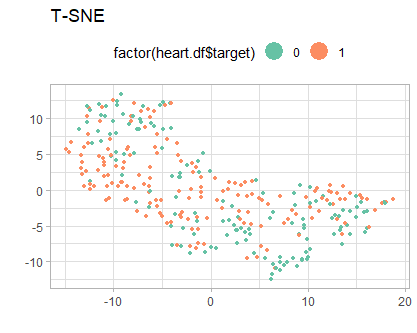

	자료 분석 이 전, t-sne로 데이터를 시각화 한 그림이다. target 값 0과 1이 명확히 분리되어 있지 않다. 이는 모델 생성 후 예측시 어느정도의 한계가 존재할 것으로 예상된다.
	  
- (3) 전처리 (preprocessing)
	- 이상점 대체

  	 
	 
	 

	 각 연속형 변수에 대하여 Box-Plot 을 그려 이상점을 확인했다. 위의 그림은 그 중 이상점을 가지고 있는 세 변수 콜레스트롤, 최대 심박수,ST-depression (ecg 기능선 하강 정도) 의 box-plot 이다.

	 stat   | cholestrol |  max_heartrate  | ST_depression
	 -------|------------|-----------------|-------------- 
 	 min    | 126.0   | 71.0    | 0.000  
 	 1st Qu.| 211.0   | 133.2   | 0.000  
 	 Median | 240.5   | 152.5   | 0.800  
 	 Mean   | 246.5   | 149.6   | 1.043  
	 3rd Qu.| 274.8   | 166.0   | 1.600  
 	 Max.   | 564.0   | 202.0   | 6.200  
	
	상한 값 = $Mean + 1.5 * (3rd Qu. - 1st Qu.)$
	
	하한 값 = $Mean - 1.5 * (3rd Qu. - 1st Qu.)$

	각 변수의 기초 통계량을 이용하여, 이상점을 다른 값으로 대체하였다. cholestrol 에서 500 이상의 값을 상한값 371 로, max_heartrate 에서 80 아래의 값을 106.5 로, ST_depression 에서 5 이상의 값을 4.5 로 대체하였다.
	
	- 범주 통합

	자료의 변수 중 두 변수가 의미상 포함관계가 있음을 확인했다. **Exercise_angina** 는 운동을 하였을 때 협심증(angina)을 경험하였는지 여부에 대한 변수이고, **chest_pain** 변수의 value 0 는 정형적인 협심증(angina) 경험을 나타내는 값이다. 여기서 정형적인 협심증이란 '운동 혹은 스트레스에 의한 협심증' 의미하기에 운동하였을 때 협심증 여부(_Exercise angina_) 변수와 통합할 것을 고려하였다.
 
	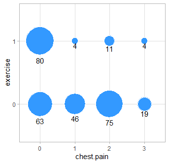

	위의 그림은 가로 축 chest_pain, 세로 축 운동시 협심증 (exercise_angina) 두 변수의 각 범주에 전체 관측이 얼마나 있는지 확인하기 위해 그린 버블차트이다. 각 원 아래의 숫자는 8개의 각 범주별 관측의 수를 의미한다. chest_pain 의 value 0 외에서는 exercise_angina 의 value 1의 관측의 수가 차이나게 적음을 확인할 수 있다. (4/302=0.0132, 11/302=0.0364, 4/302=0.0132)

 	 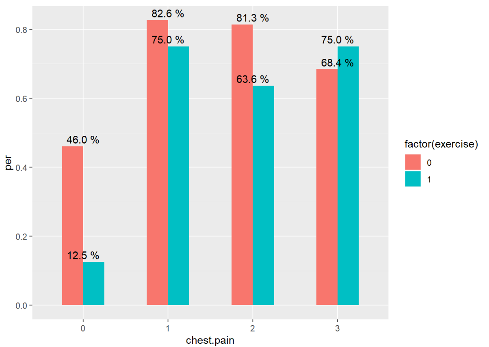

	각 8개의 범주에서 관측의 수가 아닌 target 1의 비율의 관점에서도 확인하였다. 그래프의 세로 축은 각 범주의 전체 관측을 분모로하여, target = 1이 차지하는 비율을 의미한다. 흉통의 정형적인 협심증(value 0) 중에서 이것이 운동으로 인한 협심증 경험(녹색, value=1) 인 관측들은 심장병의 비율이 현저히 낮은 것을 확인할 수 있다. 또한 chest_pain의 value 0 를 제외한 나머지 값에서 운동을 하였을 때 협심증 경험 여부와 상관없이 target=1의 비율이 상대적으로 높은 값을 가짐을 확인했다.
		
	 이를 근거로 모형의 복잡성을 줄이기 위해, exercise_angina 변수를 선택에서 제외하였다. 이 후 chest_pain 변수의 value 0 "정형적인 협심증"을 정형적인 협심증(운동 제외)과 정형적인 협심증(운동) 으로 나누었다.

	- 결측으로 처리

	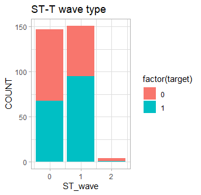

	위의 ST-T wave type 변수에서의 value 2 = "좌심실 비대로 인한 ST-Wave 이상" 이다. 관측 4개이며, 이는 전체의 0.0132으 매우 적은 수임을 확인했다. value 0 ="정상", value 1 = "ST-T wave 이상" value 2 = "좌심실 비대로 인한 ST-T wave 이상" 이다. value 2는 좌심실 비대로인한 ST-T wave 이상으로, 심장병이 아닌 다른 원인에 의한 ST-T wave 이상이기에 어느 값과 통합이 불가하여 모형의 복잡성을 줄이기 위해, 결측으로 처리하였다.

	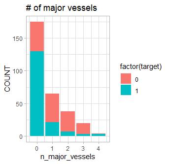
	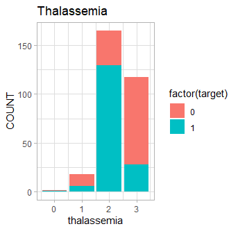
	
	위의 그림을 통해, 두 변수에 데이터 변수 정보에 주어지지 않은 범주를 갖고 있음을 확인했다. 또한 그림을 통해, 값 자체가 전체에서 차지하는 비중이 매우 적음을 알 수 있다.  n major vessels 변수의 value 4(0.0132) 와 Thalassemia 변수의 value 0(0.0066)은 결측으로 처리하였다.

	추가로, 유전적 결함 (Thalassemia) 변수는 현재 1: 정상 2: 고정적 결함 3: 가역적 결함의 값을 갖고 있다. 유전적 결함이 심각한 수준에 대하여 순서를 매긴다면 정상 < 가역적 결함 < 고정적 결함 순서이다. 이는 순서형 변수로 보는 것이 적절하여, 1: 정상 2: 가역적 결함 3: 고정적 결함으로 스코어를 다시 매겼다. 

	slope 는 힘든 운동을 한 후 ST-T SEGMENT의 경사면 기울기가 상승(0), 평평_변화없음(1), 하강(2)에 대한 값을 갖는 변수이다. 경사면의 기울기 정도를 나타내는 값이므로 경사면의 기울기를 기준으로(하강 < 평평 < 상승) 순서형으로 생각될 수 있다. 하지만 ST-segment가 상승 혹은 하강할 때 두 경우 모두 평평할 때(일반적)와 달리, 원인이 된다. ST-T Segment가 상승하는 경우, 급성심근경색, 변형 협심증, 급성 심막염 등의 질환이 있을 수 있고, ST-Segment가 하강하는 경우 발작성 가슴조임증, 심장속막밑 심근경색, 저칼륨혈증 등의 질환의 가능성이 있다. 그렇기에 slope 는 범주형 변수로 취급하였다.

- (4) Missing value 처리

	해당 자료는 총 10개의 NA 가 있으며(0.033), 이는 전체의 자료 크기에 비해 적은 수이기에 모델 적합시에 큰 영향을 주지 않는다. 하지만 다양한 방법을 최대한 활용하는 것이 목표이기에, 결측을 대체하였다.
	
	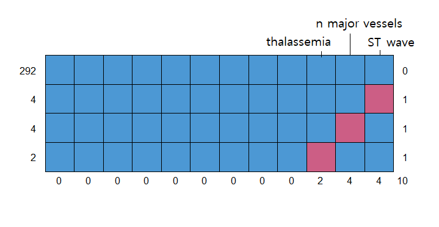

	총 292개의 관측에는 결측이 없으며 4개의 관측이 ST_wave에, 다른 4개의 관측이 n_major_vessels 에, 다른 2개의 관측이 thalassemia에 NA가 존재한다. 결측을 가지는 변수 ST_wave는 범주형, n_major_vessles는 계수형, thalassemia는 순서형 자료이다. 또한 K-NN과 같은 거리 기반 알고리즘은 연속형 변수가 13개 중 5개이기에 결측값 대체하기에 부적절하다. 그렇기에 의사결정나무(Cart)를 이용하여 결측을 대체하였다. 

	- rpart :
		결측이 있는 변수를 종속변수로 하고, target(y값)과 종속변수를 제외한 나머지 공변량을 설명변수로 둔 의사결정나무 모델을 각각 생성하였다.

		- ST_wave (4)
		 
		 |   obs | 7 | 30 | 100 | 612 
		 |-------|---|----|-----|-----
		 |   p(normal) | 0.6667 | 0.7895 | 0.2381 | 0.6371 

	  ST_wave가 종속변수로 쓰인 분류 회귀 나무 모델을 생성하였다. 위는 ST_wave 가 NA 인 각 관측의 normal 일 확률을 제시한 표이고, 확률 값에 따라 결측을 대체하였다.
		
		- n_major_vessels (4)

         |  obs |  p(0)  |  p(1)   |  p(2)  | p(3)
		 |------|--------|---------|--------|-------
		 |  53  | 0.8269 | 0.0961  | 0.0384 | 0.038
		 |  129 | 0.6857 | 0.2286  | 0.0857 | 0.000
		 |  349 | 0.8269 | 0.0962  | 0.0385 | 0.038
		 |  522 | 0.7500 | 0.0833  | 0.1667 | 0.000
 	
	   n_major_vessels 가 종속변수로 쓰인 분류 회귀 나무 모델을 생성하였다. n_major_vessels 가 NA 인 각 관측이 0,1,2,3의 값을 가질 확률을 제시한 표이고, 이에 따라 결측을 대체하였다.

		- thalassemia (2)

		 |  obs |  p(0)   |  p(1)   |  p(2)
		 |------|---------|---------|--------
		 |  15  | 0.111   | 0.7407  | 0.1481
		 |  320 | 0.000   | 0.1071  | 0.8929
 	
	   thalassemia 가 종속변수로 쓰인 분류 나무 모델을 생성하였다. thalassemia 가 NA 인 각 관측이 0,1,2 의 값을 가질 확률을 제시한 표이고, 이에 따라 결측을 대체하였다.

	- mice 대체 : 

		 R 의 mice package를 이용해 max 반복 횟수는 10으로 결측을 대체하였다. rpart에서와 마찬가지로, target을 제외한 데이터 셋을 사용하였으며, 앞의 방법인 rpart와 비교하기 위해 역시 사용한 방법론은 분류회귀나무(cart)이다. 각 결측에 대하여 10개의 대체 셋을 반복하여 만든 후, 중앙의 값을 가져와 결측 대체하는데 사용하였다.

- (5) 처리된 자료 (preprocessed data)

	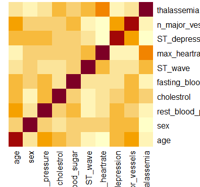

	범주가 3개 이상인 범주형 변수와 y값을 제외한 10개의 변수를 이용하여 히트맵을 그려 상관계수를 확인했다. 이 때 다중공선성으로 문제 될 변수 짝은 없다.

	이와 같은 처리 과정을 거쳐, 학습기에 인입할 데이터 셋은 총 세 가지이다. 하나는 결측을 모두 제거한 데이터셋 **heart.rm**(292X13)이다. 다른 두 개는 결측 대체시 rpart 함수를 이용한 **heart.rpart** (302X13), mice 함수를 이용한 **heart.mice** (302X13)이다. 세 개의 데이터 셋을 이용하여 모델을 적합할 때, train set 에 들어간 관측은 결측 관측 8개를 제외하고 모두 같게 설정하였다. 세 개의 데이터 셋에서 valid set 에 들어간 관측 역시 결측 관측 2개를 제외하고 모두 같게 설정하였다.

- (6) 데이터셋 분할
	
 	 

	최대한 많은 데이터를 학습에 이용하기 위해, 데이터 셋은 Cross Validation 방법으로 분할하였다. 그림과 같이 전체의 완전한 데이터 셋을 train : valid = 4 : 1 로 하여 총 5번 분할하였다. 관측의 수가 302개로 적어, test 셋은 고려하지 않았다.

- (7) 오류 측도 : 1 - AUC

	

	각 k에 따른 모델의 비교함에 있어 사용한 ERROR 측도는 **1-AUC** 이다. 정확도, 민감도, 특이도 등을 최고로 높이는 cut-off 는 각 k 마다 모두 다를 것이기에, cut-off 값을 미리 고려하지 않아도 되는 AUC를 이용했다. 초모수를 필요로 하는 각 방법론들에서 각 k에 같은 초모수를 이용하였을 때 얻을 수 있는 모델의 error 측도를 평균내어 가장 낮은 error 를 갖게 해주는 초모수를 선택하였다.

	
## 2. Methods
- 사용한 방법론
	- 분류 회귀 나무 (rpart) : 
		변수의 결측 값 대체에 있어 사용했다.

	- MICE

	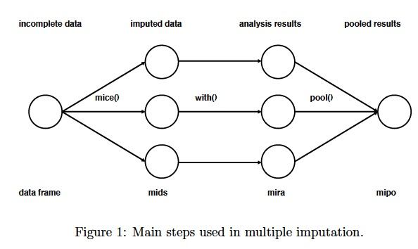

	[Mice](https://stefvanbuuren.name/mice/reference/mice.html) 는  다변량의 불완전한 데이터에 대한 다중 교체 값을 생성하는 R 라이브러리이다. 결측이 존재하는 각각의 변수는 별도의 단변량 모델을 설정할 수 있으며 모델에 근거한 신뢰가능한 합성 값을 반복(_maxit_)을 거쳐 데이터셋을 생성해준다. 

	- Glmnet : 
		glmnet 의 목적함수 $minimize \{ {\phi (x)} + \lambda * ||\beta||_1 \}$ 에서 $\lambda$ 값을 $2$ 와 $2^{-10}$ 사이의 100개의 등간격 숫자를 선택하여 모델 생성시에 이용하였다.

	- Random Forest : 
		초기 Random Forest 모델 생성시에 사용한 tree의 수 B = 10, 20, ..., 100 이다.

	- Gradient Boost : 초기 모델 생성시에 이용한 모수 max depth (d) = 1,2,3,4 이고, shrinkage factor $\epsilon$ = 0.05, 0.0505, 0.051, 0.0515, ..., 0.25 이고, tree의 수 B = 10, 20, ..., 100 이다.

## 3. Results

 0. 각 모델의 ERROR 평균

     | rank | dataset | method | error
	 |------|---------|--------|-----------
	 | 1 | mice | Gradient Boost | 0.07761351
     | 2 | rpart | Gradient Boost | 0.07840075
	 | 3 | na.removed | Gradient Boost | 0.08217781
	 | 4 | rpart | glmnet | 0.09429403
	 | 5 | mice | glmnet | 0.09474763
	 | 6 | na.removed | glmnet | 0.09789467
	 | 7 | mice | RandomForest | 0.09976039
 	 | 8 | na.removed | RandomForest | 0.10426216
	 | 9 | rpart | RandomForest | 0.10426216
 
  위는 각 데이터 셋에서의 3가지 방법론에 의해 측정된 error 를 오름차순으로 정렬한 표이다. 대체로 성능은 _Gradient Boost_, _glmnet_, _Random Forest_ 순으로 좋았으며, 각 데이터 셋 중에서 결측을 제거한 모델의 성능이 결측을 대체한 모델에 비해 대체로 성능이 떨어졌다.

 1. Glmnet 

 	아래는 각 데이터 셋에서 선택된 lambda 값과 그에 따른 error를 제시한 표이다.
	  
	 | dataset |     lambda  |   error   | $D_{null}-D_{model}$ |  p-value
	 |---------|-------------|-----------|----------------------|---|-------
	 | na.removed | 0.007812500 | 0.09789467 | 197.5972 | <.0001
	 | rpart   |   0.003616698 | 0.09429403 | 196.3003 |  <.0001
	 | mice    |   0.003100393 | 0.09474763 | 196.7043 | <.0001

    $$Dev.ratio = 1 - \frac{D_{model}}{D_{null}}$$

	$D_{null}-D_{model}$ 는 glmnet 함수가 모델 적합과 동시에 제공해주는 Dev.ratio와 nulldev 를 이용하여 계산하였다.

	$$ H_0 : Null Model  : logit(pi) = \alpha_0 $$
	$$ H_1 : logit(pi) = X_i^t * \beta $$

	 Deviance(이탈도) 를 기준으로 세 데이터셋으로 생성한 각 glmnet 모델들이 유의미한 모델임을 확인했다.(p-value<.0001) 데이터 셋은 error를 기준으로 rpart를 이용하여 결측을 대체하였을 때, 성능이 가장 좋았다.
	 
 	 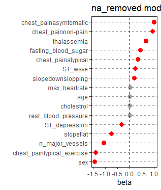
	 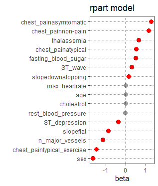
	 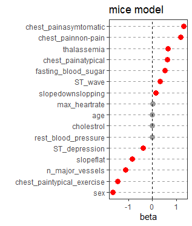
	 
	 다음은 각 베타 계수를 x 축으로 하고 각 변수의 index를 y 축으로 한 그래프이다. 세 데이터 셋 모두 유사하게 그려졌다. 세 경우 모두 변수 age 가 선택에서 제외되었다. 추가로, beta=0 축에 가까운 변수 최대 심박수(_max heartrate_), _cholestrol_, 휴식시 혈압(_rest blood pressure_) 세 변수 모두 양적 변수이다. 이는 0과 1의 값을 갖는 다른 범주형 변수보다 훨씬 큰 범위의 실수 값을 갖기에 $\beta = 0$ 근처의 값을 갖는 것이며 선택에서 제외된 변수는 아니다. 

 2. Random Forest
	 | dataset | n_tree  |  error
	 |---------|---------|----------
	 | na.removed | 70 | 0.10426216
	 | rpart  | 70 | 0.10426216
	 | mice   | 90 | 0.09976039

	 Random Forest model 들의 경우에는 다른 모델들에 비해 성능이 떨어졌다.

	 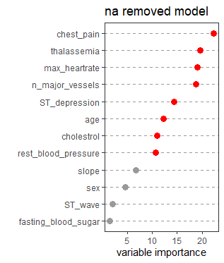
	 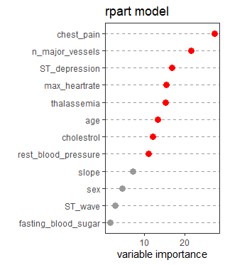
	 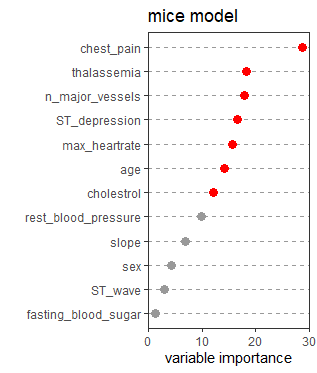

	 위는 각 데이터셋 모델 적합시에 사용되었던 변수들의 중요도이다. 여기서 중요도는 '각 변수가 불순도(_gini_)를 감소시키는 정도'의 평균을 의미한다. 감소하는 정도가 클 수록, 변수 중요도가 높다고 볼 수 있다. 상대적으로 중요도가 낮은 변수는 _slope_, _sex_, 심전도 파동 이상 유무(_st wave_), 공복 혈당(_fasting blood sugar_) 이다. 상대적으로 변수의 중요도가 높은 변수는 흉통(_chest pain_)과 유전적 결함(_thalassemia_), 착색되는 혈관의 수(_n major vessels_), 최대 심박수(_max heart rate), 운동 후 휴식시 ECG 기능선 하강 정도(_ST depression_) 5가지 변수이다.

	 앞의 _glmnet_ 에서 모델 적합시 유일하게 제외되었던 변수 _age_ 가 랜덤포레스트 모델에서는 변수 중요도가 높은 것을 확인할 수 있다. _glmnet_ 에서 변수 age 를 제외시키고 생성한 모델이 _random forest_ 의 모든 변수를 사용한 모델보다 성능면에서 더 좋았다. 이를 토대로, age 변수를 제외하여 다시 _random forest_ 모델 적합을 시도하여도 좋을 것이다. 

 3. Gradient Boost
	 | dataset | max_depth | shrnk |  n.tree  |  error
	 |---------|-----------|-------|----------|---------
	 | na.removed |  1  | 0.1990  | 60  | 0.08217781
	 | rpart  |  4  | 0.2285  | 20 | 0.07840075
	 | mice   |  1  | 0.1840  | 80 | 0.07761351
	 
	Gradient Boost model 들의 경우에는 다른 모델들에 비해 성능이 우수했다. 

	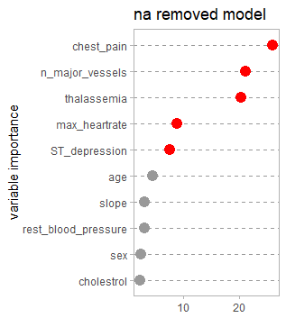
	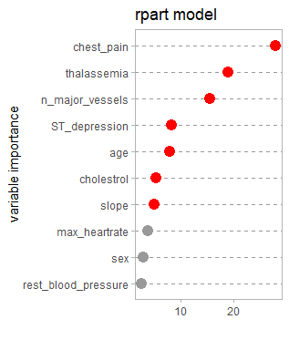
	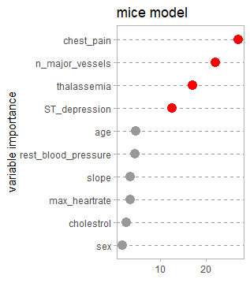		 
	 
	그래디언트 부스트에서 공통적으로 중요도가 높았던 변수는 흉통(_chest pain_), 착색되는 혈관의 수 (_n major vessels_), 유전적 결함(_thalssemia_), ecg 기능선 하강 정도(_ST depression_) 네 개이다. 이 변수 네개는 앞의 랜덤 포레스트 모델에서 또한 중요도가 높았던 변수이다. 변수의 중요도가 낮은 변수 또한 랜덤 포레스트와 유사했다. 운동 후 휴식시 혈압(_rest blood pressure_), _sex_, _cholestrol_과 위 그림에서 나타나지 않는 공복혈당(_fasting blood sugar_),  _ST wave_ 5가지 이다. 
	
## Concluding remarks

- 결과 요약
 
 결측 대체를 하였을 때, 제거한 모델보다 성능은 거의 유사하거나 조금 더 좋았다. 해당 데이터 셋을 이용하여 결측을 대체할 때, 의사결정나무 모델을 사용하는 것이 적절했다. Error 측도를 기준으로, 상위 3개의 모델 모두 Gradient Boost 이다. 따라서 Gradient Boost 가 심장질환 분류 및 예측에 있어 적합하다는 것을 알 수 있다.

- Future works

 이번 과제를 통해, 분류를 위한 최소한의 속성 변수를 찾아내는 것은 시도하지 못했다. 모델 생성시에 상대적으로 중요도가 낮은 변수 ST 파동 (ST wave), 공복 혈당(fasting blood sugar), slope 이다. 이 세 가지 변수를 제외하여 다시 모델 적합을 시도해볼 것이다. 사용하는 변수의 개수를 조금 더 줄일 수 있다면 비용 관점에서 심장질환 예측의 효율적으로 진행할 수 있을 것이다.